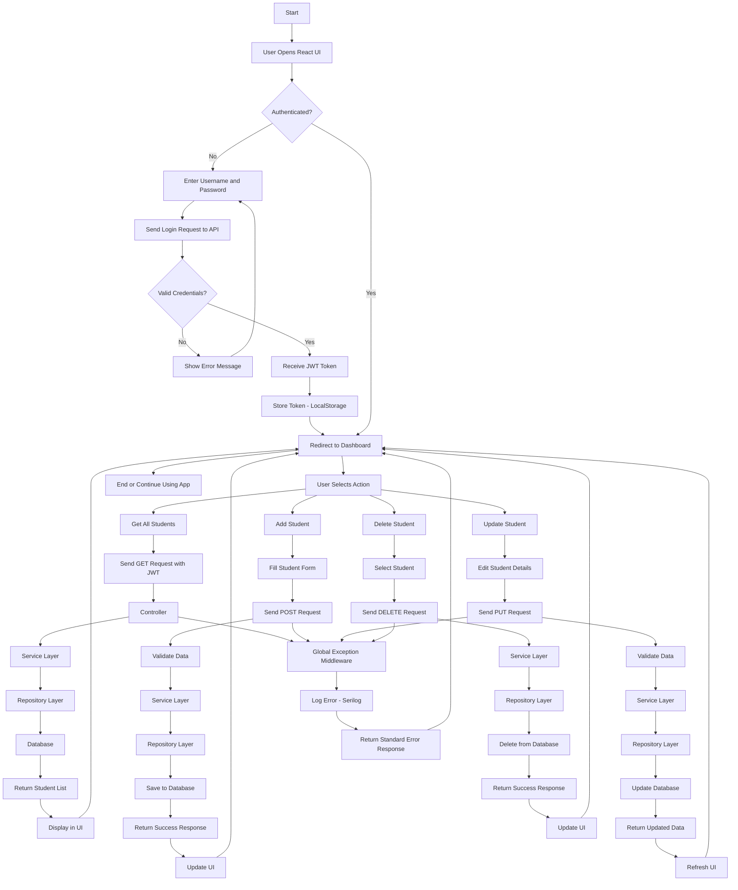

# Task2_Project_DotNet_Assignment
 This assignment evaluates your practical skills in .NET Core, SQL, and API development.

 # Student Management System

A full-stack Student Management System built as a technical assignment.

## Features Included
- **ASP.NET Core Web API 10.0** with Layered Architecture (Controllers, Services, Repositories)
- **React UI** built with Vite, featuring a premium glassmorphic "anti-gravity" modern aesthetic powered by Framer Motion.
- **Dockerized Setup** for both Database and API
- **JWT Authentication** (Secure API endpoints and login flow)
- **Global Exception Handling Middleware** for unified error responses
- **Serilog** for structural logging
- **Swagger UI** for API documentation
- **Unit Testing** with xUnit and Moq


---
## Repository link

GitHub Repository Link : https://github.com/SamruddhiKangude/Task2_Project_DotNet_Assignment

---

## 🚀 Setup & Execution

### Option 1: Running with Docker (Recommended)
This approach sets up both the SQL Server database and the .NET Web API in containers.

1. Ensure [Docker Desktop](https://www.docker.com/products/docker-desktop) is running.
2. In the root directory of the project, run:
   ```bash
   docker-compose up --build
   ```
3. The API will be available at `http://localhost:5000`. You can test Swagger at `http://localhost:5000/swagger`.
4. Run the React Frontend (in a separate terminal):
   ```bash
   cd StudentManagement-ui
   npm install
   npm run dev
   ```
5. The React application will start at `http://localhost:5173`. 

---

### Option 2: Running Locally (Manual Build)
If you don't use Docker, ensure you have **.NET 10.0 SDK**, **Node.js**, and a running **SQL Server** instance.

1. **Database Setup**
   - Open `StudentManagement.API/appsettings.json` and change the `DefaultConnection` string to point to your local SQL Server instance.

2. **Run Backend**
   ```bash
   cd StudentManagement.API
   dotnet restore
   dotnet run
   ```
   *Note: Entity Framework Code First relies on `context.Database.Migrate()` on startup, meaning the schema and a default `admin` user are created automatically.*

3. **Run Frontend** 
   ```bash
   cd StudentManagement-ui
   npm install
   npm run dev
   ```

---

## 🧪 Running Unit Tests
To run the included unit tests (which cover `StudentService`):
```bash
dotnet test
```
---

## 🔐 Default Credentials
To access the Dashboard through the React UI, use the default seeded credentials:
- **Username:** `admin`
- **Password:** `admin123`

---

## 🏗️ Architecture Design
- **API Project:** Contains Controllers, Middleware, and API configuration.
- **Core Library:** Contains Domain Models (`Student`, `User`), DTOs, and Service/Repository Interfaces.
- **Infrastructure Library:** Contains Entity Framework `AppDbContext`, and implementations of Repositories and Services.
- **Tests Project:** xUnit testing logic.
- **React UI:** Context API for Authentication handling, Axios interceptors, Framer Motion for premium UX.

--- 

## 🔄 Logic Flowchart ( flowchart TD )


